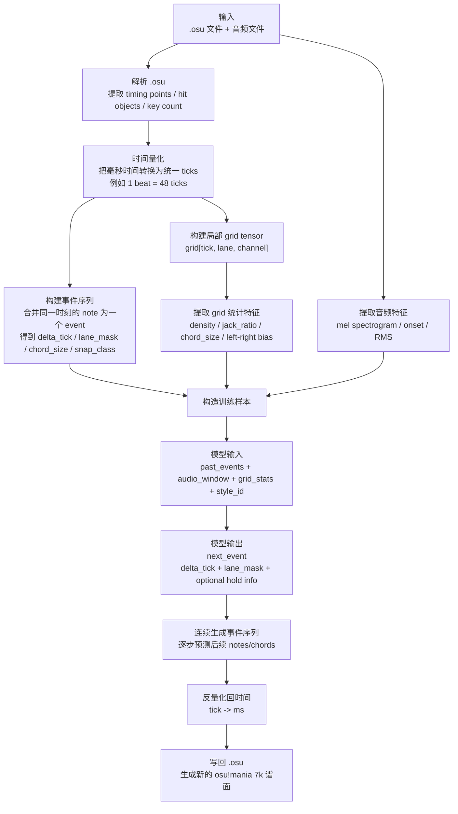
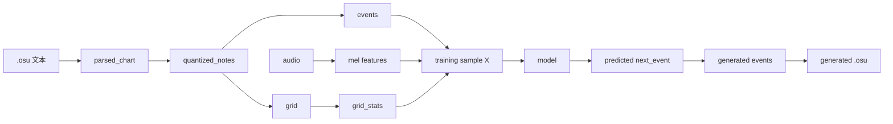
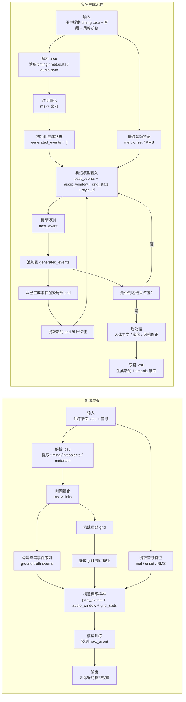

# Beatmap Generator Flowcharts

## Pipeline Flowchart

```mermaid
flowchart TD
    A["输入<br/>.osu 文件 + 音频文件"] --> B["解析 .osu<br/>提取 timing points / hit objects / key count"]
    B --> C["时间量化<br/>把毫秒时间转换为统一 ticks<br/>例如 1 beat = 48 ticks"]
    C --> D["构建事件序列<br/>合并同一时刻的 note 为一个 event<br/>得到 delta_tick / lane_mask / chord_size / snap_class"]
    C --> E["构建局部 grid tensor<br/>grid[tick, lane, channel]"]
    A --> F["提取音频特征<br/>mel spectrogram / onset / RMS"]

    E --> G["提取 grid 统计特征<br/>density / jack_ratio / chord_size / left-right bias"]
    D --> H["构造训练样本"]
    F --> H
    G --> H

    H --> I["模型输入<br/>past_events + audio_window + grid_stats + style_id"]
    I --> J["模型输出<br/>next_event<br/>delta_tick + lane_mask + optional hold info"]

    J --> K["连续生成事件序列<br/>逐步预测后续 notes/chords"]
    K --> L["反量化回时间<br/>tick -> ms"]
    L --> M["写回 .osu<br/>生成新的 osu!mania 7k 谱面"]
```

## Data Flowchart

```mermaid
flowchart LR
    A[".osu 文本"] --> B["parsed_chart"]
    B --> C["quantized_notes"]
    C --> D["events"]
    C --> E["grid"]
    F["audio"] --> G["mel features"]

    E --> H["grid_stats"]
    D --> I["training sample X"]
    G --> I
    H --> I

    I --> J["model"]
    J --> K["predicted next_event"]
    K --> L["generated events"]
    L --> M["generated .osu"]
```

## Training Vs Inference Flowchart

```mermaid
flowchart LR
    subgraph T["训练流程"]
        T1["输入<br/>训练谱面 .osu + 音频"] --> T2["解析 .osu<br/>提取 timing / hit objects / metadata"]
        T2 --> T3["时间量化<br/>ms -> ticks"]
        T3 --> T4["构建真实事件序列<br/>ground truth events"]
        T3 --> T5["构建局部 grid"]
        T1 --> T6["提取音频特征<br/>mel / onset / RMS"]
        T5 --> T7["提取 grid 统计特征"]
        T4 --> T8["构造训练样本<br/>past_events + audio_window + grid_stats"]
        T6 --> T8
        T7 --> T8
        T8 --> T9["模型训练<br/>预测 next_event"]
        T9 --> T10["输出<br/>训练好的模型权重"]
    end

    subgraph I["实际生成流程"]
        I1["输入<br/>用户提供 timing .osu + 音频 + 风格参数"] --> I2["解析 .osu<br/>读取 timing / metadata / audio path"]
        I2 --> I3["时间量化<br/>ms -> ticks"]
        I1 --> I4["提取音频特征<br/>mel / onset / RMS"]
        I3 --> I5["初始化生成状态<br/>generated_events = []"]
        I5 --> I6["构造模型输入<br/>past_events + audio_window + grid_stats + style_id"]
        I4 --> I6
        I6 --> I7["模型预测<br/>next_event"]
        I7 --> I8["追加到 generated_events"]
        I8 --> I9["从已生成事件渲染局部 grid"]
        I9 --> I10["提取新的 grid 统计特征"]
        I10 --> I6
        I8 --> I11["是否到达结束位置?"]
        I11 -->|否| I6
        I11 -->|是| I12["后处理<br/>人体工学 / 密度 / 风格修正"]
        I12 --> I13["写回 .osu<br/>生成新的 7k mania 谱面"]
    end
```
